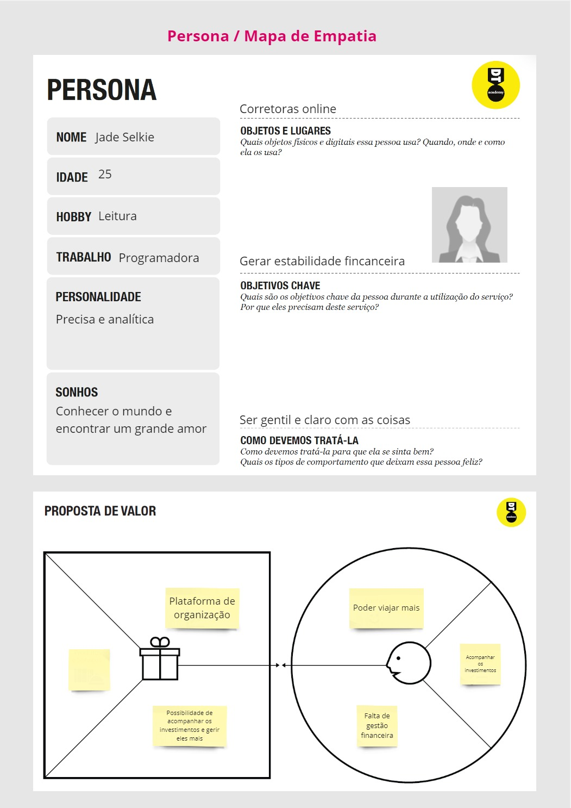
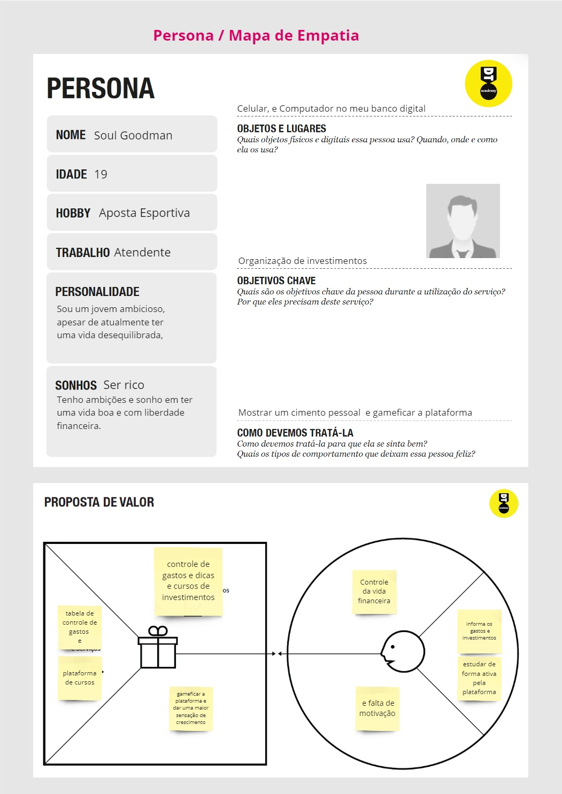
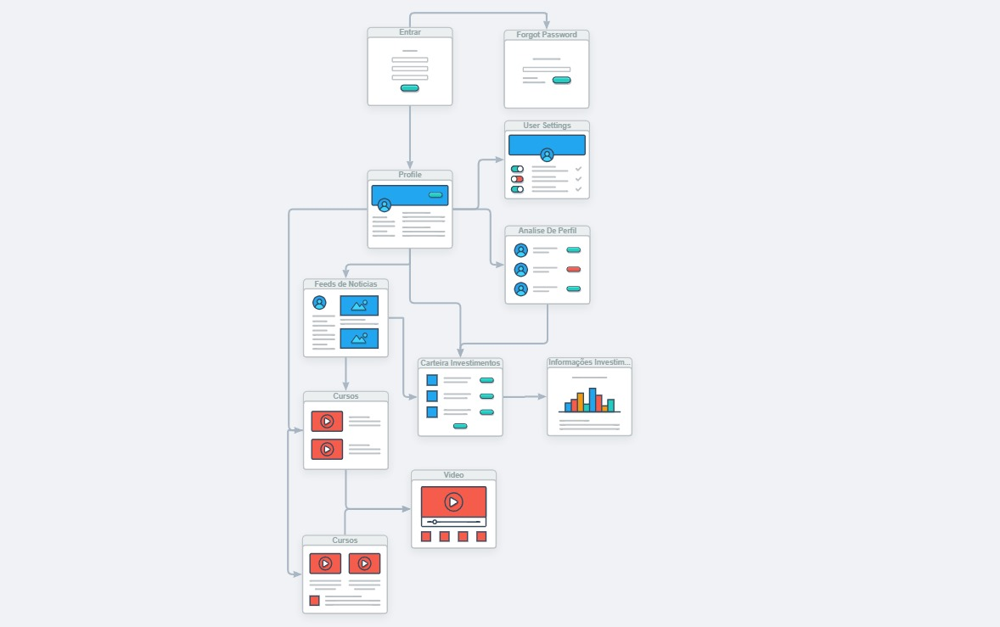
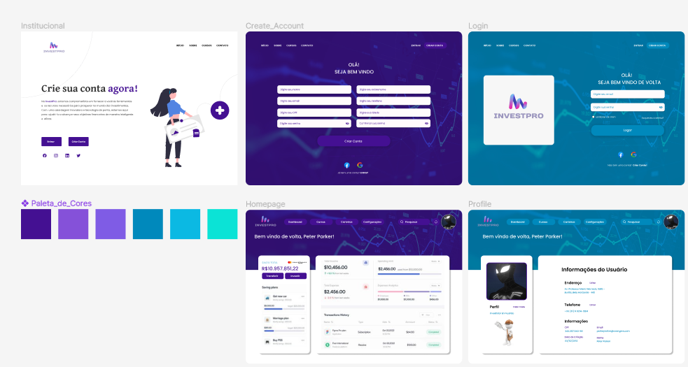
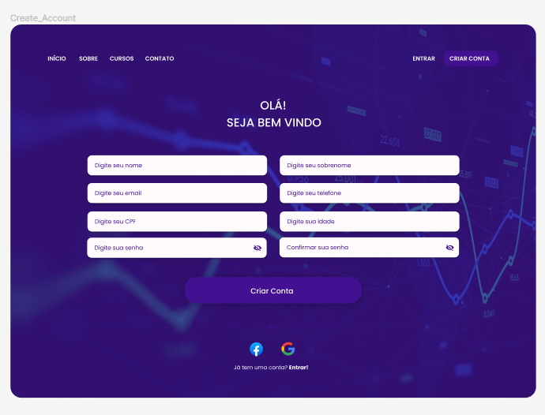
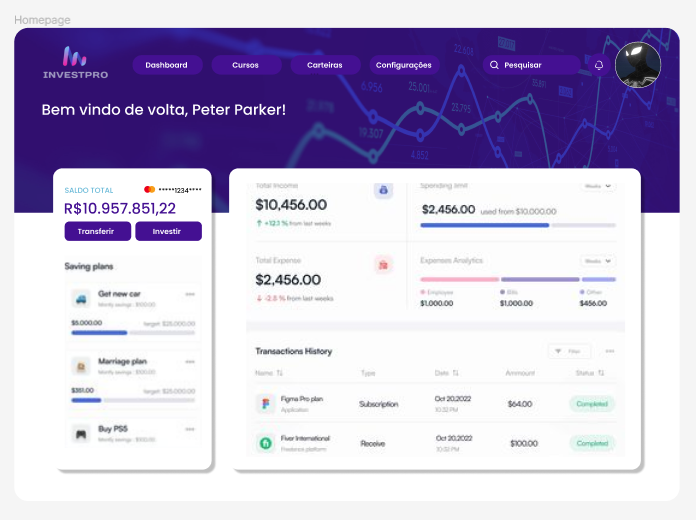
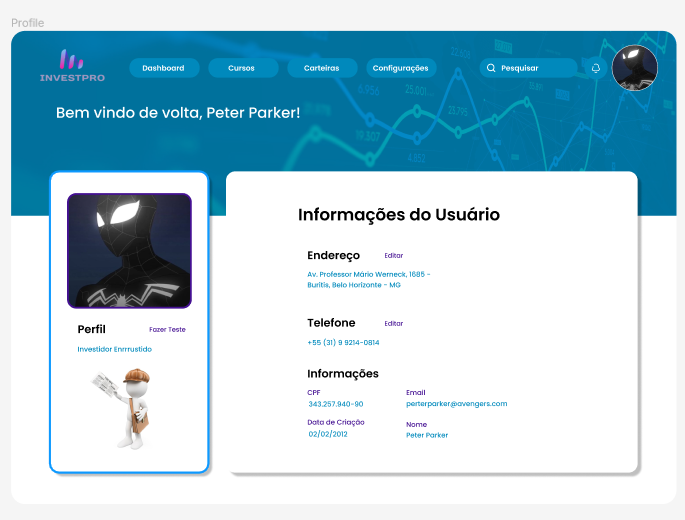

# Informações do Projeto
`TÍTULO DO PROJETO`  

InvestPro

`CURSO` 

Engenharia de Software

## Participantes
Os membros do grupo são: 
* Gabriel Marcondes Starling Rocha
* João Eduardo Soares
* João Pedro Peres Barbosa
* Lucas José Lopes Ferreira
* Mateus Rodrigues Costa 

# Estrutura do Documento

- [Informações do Projeto](#informações-do-projeto)
  - [Participantes](#participantes)
- [Estrutura do Documento](#estrutura-do-documento)
- [Introdução](#introdução)
  - [Problema](#problema)
  - [Objetivos](#objetivos)
  - [Justificativa](#justificativa)
  - [Público-Alvo](#público-alvo)
- [Especificações do Projeto](#especificações-do-projeto)
  - [Personas e Mapas de Empatia](#personas-e-mapas-de-empatia)
  - [Histórias de Usuários](#histórias-de-usuários)
  - [Requisitos](#requisitos)
    - [Requisitos Funcionais](#requisitos-funcionais)
    - [Requisitos não Funcionais](#requisitos-não-funcionais)
  - [Restrições](#restrições)
- [Projeto de Interface](#projeto-de-interface)
  - [User Flow](#user-flow)
  - [Wireframes](#wireframes)
- [Metodologia](#metodologia)
  - [Divisão de Papéis](#divisão-de-papéis)
  - [Ferramentas](#ferramentas)
  - [Controle de Versão](#controle-de-versão)
- [**############## SPRINT 1 ACABA AQUI #############**](#-sprint-1-acaba-aqui-)
- [Projeto da Solução](#projeto-da-solução)
  - [Tecnologias Utilizadas](#tecnologias-utilizadas)
  - [Arquitetura da solução](#arquitetura-da-solução)
- [Avaliação da Aplicação](#avaliação-da-aplicação)
  - [Plano de Testes](#plano-de-testes)
  - [Ferramentas de Testes (Opcional)](#ferramentas-de-testes-opcional)
  - [Registros de Testes](#registros-de-testes)
- [Referências](#referências)

# Introdução

## Problema

Investir no mercado financeiro pode ser complicado e desafiador. Muitas pessoas têm dificuldade em entender como investir, o porquê investir e como gerenciar efetivamente seus investimentos. Além disso, o controle de investimentos pode ser confuso e demorado, especialmente ao lidar com múltiplas contas e instituições financeiras.

InvestPro enfrenta o desafio de simplificar esse processo para investidores de todos os níveis de experiência. A plataforma visa fornecer educação financeira, orientação especializada e ferramentas poderosas para facilitar o gerenciamento e controle de investimentos, permitindo aos usuários tomar decisões mais inteligentes e maximizar seus retornos financeiros.

## Objetivos

Desenvolver um software eficiente e intuitivo para simplificar o processo de investimento, fornecendo educação financeira, orientação especializada e ferramentas de gerenciamento de investimentos, a fim de ajudar investidores de todos os níveis de experiência a tomar decisões informadas e maximizar seus retornos financeiros.

1. **Desenvolvimento de uma Plataforma Educacional:**
   Criar uma seção educacional dentro da plataforma InvestPro, oferecendo recursos como artigos, vídeos e tutoriais interativos para fornecer aos usuários conhecimentos básicos sobre investimentos, estratégias de investimento e gestão de carteiras. O objetivo é capacitar os investidores a entenderem melhor o mercado financeiro e tomarem decisões mais conscientes.

2. **Implementação de Ferramentas de Controle e Comparação de Investimentos:**
   Desenvolver ferramentas que permitam aos usuários acompanhar facilmente o desempenho de seus investimentos, realizar comparações entre diferentes ativos e instituições financeiras, e facilitar a portabilidade de dados entre contas. Isso incluirá a integração de APIs de instituições financeiras para fornecer acesso direto aos dados dos investidores e a criação de algoritmos de análise para gerar insights relevantes sobre o desempenho dos investimentos. O objetivo é simplificar o controle e a gestão das carteiras de investimento, permitindo aos usuários otimizar seus portfólios e maximizar seus resultados financeiros.

## Justificativa

Investir dinheiro é uma atividade crucial para muitas pessoas e empresas, e pode ter um impacto significativo em seu bem-estar financeiro futuro. No entanto, o processo de investimento pode ser complexo e intimidador para aqueles que não têm experiência ou conhecimento adequado. Aqui estão algumas razões pelas quais escolhemos trabalhar com a aplicação InvestPro e definir os objetivos específicos:

1. **Democratização do Conhecimento Financeiro:**
   Muitas pessoas evitam investir simplesmente porque não entendem como funciona o mercado financeiro. Ao desenvolver uma plataforma educacional dentro do InvestPro, podemos ajudar a democratizar o conhecimento financeiro, tornando as informações sobre investimentos acessíveis e compreensíveis para um público mais amplo. Isso pode motivar mais pessoas a começarem a investir e a tomar melhores decisões financeiras para o seu futuro.

2. **Facilitar o Controle e Gerenciamento de Investimentos:**
   Gerenciar investimentos pode ser uma tarefa desafiadora, especialmente para aqueles com múltiplas contas e investimentos em diferentes instituições financeiras. Implementar ferramentas de controle e comparação de investimentos no InvestPro pode simplificar esse processo, fornecendo aos investidores uma visão clara e abrangente de seus portfólios e permitindo que façam ajustes estratégicos com base em dados precisos e atualizados. Isso pode ajudar os investidores a maximizar seus retornos e minimizar seus riscos ao longo do tempo.

3. **Promover a Confiança e Segurança dos Investidores:**
   Muitas vezes, a falta de transparência e controle pode levar os investidores a se sentirem inseguros em relação aos seus investimentos. Ao oferecer ferramentas que simplificam o processo de controle e comparação de investimentos, podemos promover a confiança e segurança dos investidores, permitindo-lhes tomar decisões mais informadas e sentir-se mais no controle de seu futuro financeiro.

## Público-Alvo

## Perfil dos Usuários da Aplicação InvestPro

### Investidores Iniciantes:
- **Conhecimentos Prévios:** Pouca ou nenhuma experiência em investimentos.
- **Relação com a Tecnologia:** Uso básico de dispositivos eletrônicos e aplicativos, mas com pouca familiaridade com plataformas de investimento.
- **Objetivo:** Aprender sobre investimentos, entender os conceitos básicos e começar a construir uma carteira de investimentos.

### Investidores Intermediários:
- **Conhecimentos Prévios:** Alguma experiência em investimentos, familiarizados com conceitos básicos.
- **Relação com a Tecnologia:** Uso regular de dispositivos eletrônicos e aplicativos, confortáveis em explorar novas plataformas.
- **Objetivo:** Aprofundar o conhecimento em investimentos, diversificar a carteira e otimizar o retorno sobre o investimento.

### Investidores Avançados:
- **Conhecimentos Prévios:** Experiência sólida em investimentos, entendimento avançado de conceitos financeiros.
- **Relação com a Tecnologia:** Proficiente no uso de tecnologia, familiarizados com ferramentas de análise financeira e investimento.
- **Objetivo:** Aperfeiçoar estratégias de investimento, maximizar retornos e gerenciar portfólios complexos com eficiência.

### Consultores Financeiros:
- **Conhecimentos Prévios:** Experiência profissional em consultoria financeira, certificações em finanças ou investimentos.
- **Relação com a Tecnologia:** Habilidades avançadas em tecnologia, utilização de softwares especializados em análise financeira.
- **Objetivo:** Prestar assistência aos clientes na tomada de decisões de investimento, utilizar a plataforma para análise de dados e geração de relatórios personalizados.

### Administradores de Instituições Financeiras:
- **Conhecimentos Prévios:** Experiência em gestão financeira e compliance.
- **Relação com a Tecnologia:** Proficiente em ferramentas de software financeiro e sistemas de informação.
- **Objetivo:** Utilizar a plataforma para análise de dados e monitoramento do desempenho dos investimentos sob sua responsabilidade, tomar decisões estratégicas com base nos insights fornecidos pelo InvestPro.

### Empreendedores e Gestores de Pequenas Empresas:
- **Conhecimentos Prévios:** Variedade de conhecimentos, desde básicos até avançados, dependendo da formação acadêmica e experiência profissional.
- **Relação com a Tecnologia:** Uso regular de tecnologia para fins comerciais e financeiros.
- **Objetivo:** Utilizar a plataforma para gerenciar os investimentos pessoais e/ou corporativos, otimizando os recursos financeiros da empresa e maximizando o retorno sobre o capital investido.

### Público Geral:
- **Conhecimentos Prévios:** Diversificados, desde leigos até experientes em investimentos.
- **Relação com a Tecnologia:** Varia de acordo com a faixa etária e experiência individual.
- **Objetivo:** Aprender sobre investimentos, acessar informações financeiras relevantes e tomar decisões informadas sobre suas finanças pessoais.
 
# Especificações do Projeto

Nesta parte do documento, serão detalhadas as especificações do projeto InvestPro, delineando os requisitos funcionais e não funcionais da aplicação. As seguintes técnicas e ferramentas serão utilizadas para realizar as especificações do projeto:

1. **Levantamento de Requisitos:**
   - Utilização de questionários, entrevistas e análise de documentos para identificar as necessidades dos usuários e as funcionalidades desejadas da aplicação.

2. **Prototipagem:**
   - Desenvolvimento de protótipos de baixa e alta fidelidade para visualizar a interface da aplicação e validar o fluxo de navegação e as funcionalidades propostas.

3. **Diagramas de Caso de Uso:**
   - Criação de diagramas de caso de uso para representar as interações entre os diferentes atores e os casos de uso da aplicação.

4. **Mapas Mentais e Diagramas de Fluxo de Dados:**
   - Elaboração de mapas mentais e diagramas de fluxo de dados para visualizar a estrutura da aplicação e o fluxo de informações entre os diferentes componentes do sistema.

5. **Análise de Riscos:**
   - Identificação e avaliação dos riscos potenciais associados ao desenvolvimento e implementação da aplicação, bem como a definição de estratégias para mitigá-los.

6. **Feedback dos Stakeholders:**
   - Coleta de feedback dos stakeholders, incluindo investidores, consultores financeiros, administradores de instituições financeiras e outros usuários relevantes, para garantir que as especificações do projeto atendam às suas expectativas e requisitos.

## Personas e Mapas de Empatia

O processo de criação de personas é essencial para garantir que o software atenda às necessidades e expectativas dos usuários. Utilizamos a abordagem de Design Thinking para criar personas significativas e úteis.
> ## Pessoas individadas que querem aprender sobra controle financeiro e gostariam de após sair das dívidas iniciar nesse mundo 
> 
> ## Pessoas que já tem um conhecimento previo do mercado e uma vida financeira melhor estabelecida mas tem inseguranças em investir 
> 
> ## Jovens que desejam adquirir conhecimento na area de iniciar sua vida financeiro. E estão iniciando no mercado de investimentos com
> 

## Histórias de Usuários

Com base na análise das personas forma identificadas as seguintes histórias de usuários:

| EU COMO... `PERSONA` | QUERO/PRECISO ... `FUNCIONALIDADE` | PARA ... `MOTIVO/VALOR` |
|----------------------|------------------------------------|-------------------------|
| Usuário do sistema   | Registrar minha conta              | Não perder minha organização financeira |
| Usuário do sistema   | Registrar meus investimentos       | Controle e acompanhamento de ganhos e perdas |
| Usuário do sistema   | Cadastrar conta bancária para atualização automática de dados | Não esquecer de fazê-las |
| Usuário do sistema   | Simular ganhos do investimento     | Permitir uma decisão baseada em dados sobre o investimento |
| Usuário do sistema   | Analisar o meu perfil de investidor | Para fazer os cursos e investir de uma forma que me agrade |
| Usuário do sistema   | Visualizar os cursos e meu progresso | Permitir que possam administrar o meu progresso nos cursos |

## Requisitos

As tabelas que se seguem apresentam os requisitos funcionais e não funcionais que detalham o escopo do projeto.

### Requisitos Funcionais

|ID    | Requisito                               | Descrição do Requisito                                                                               | Prioridade |
|------|-----------------------------------------| ---------------------------------------------------------------------------------------------------- | ---------- |
|RF-001| Criar conta                             | Formulário para registro de conta com nome, foto de perfil, email, senha e botão de envio.           | ALTA       |
|RF-002| Entrar                                  | Formulário de login com campos para email e senha.                                                   | ALTO       |
|RF-003| Cadastrar coretoras e banco             | Interface de administração para adicionar informações de parceiros.                                  | ALTA       |
|RF-004| Simulaçao de investimento               | Ferramenta para simular o crescimento do investimento com base em parâmetros definidos pelo usuário. | MÉDIA      |
|RF-005| Feed de noticias                        | Widget interativo exibindo notícias relevantes sobre investimentos.                                  | BAIXO      |
|RF-006| Automatização de e-mail                 | Utilização de APIs para automatizar o envio de emails para os usuários.                              | BAIXO      |
|RF-007| Analize de perfil                       | Página para inserir informações de perfil para recomendações personalizadas.                         | ALTA       |
|RF-008| Plataforma de cursos                    | Seção com cursos e materiais educacionais sobre investimentos.                                       | MÉDIA      |
|RF-009| Análise de risco e lucratividade        | Ferramenta para avaliar o risco e a lucratividade de investimentos.                                  | ALTA       |
|RF-010| Gestão de investimentos                 | Seção para acompanhar e gerenciar investimentos do usuário.                                          | MÉDIA      |

### Requisitos não Funcionais

|ID     | Descrição do Requisito  |Prioridade |
|-------|-------------------------|----|
|RNF-001| atualização automática de dados  | MÉDIA | 
|RNF-002| Uma plataforma com tempos de processamento abaixo dos 5s |  BAIXA | 
|RNF-003| Respeitar as cores de base do projeto |  BAIXA | 
|RNF-002| Uma plataforma com tempos de processamento abaixo dos 5s |  BAIXA | 

## Restrições

O projeto está restrito pelos itens apresentados na tabela a seguir.

|ID| Restrição                                             |
|--|-------------------------------------------------------|
|01| O projeto deverá ser entregue até o final do semestre |
|02| Não pode ser desenvolvido um módulo de backend        |

> Enumere as restrições à sua solução. Lembre-se de que as restrições
> geralmente limitam a solução candidata.
> 
> **Links Úteis**:
> - [O que são Requisitos Funcionais e Requisitos Não Funcionais?](https://codificar.com.br/requisitos-funcionais-nao-funcionais/)
> - [O que são requisitos funcionais e requisitos não funcionais?](https://analisederequisitos.com.br/requisitos-funcionais-e-requisitos-nao-funcionais-o-que-sao/)

# Projeto de Interface

Nesta seção, exploraremos duas etapas cruciais do Projeto de Interface: o User Flow e os Wireframes. O User Flow mapeia o caminho que os usuários seguirão dentro da aplicação, desde o primeiro contato até a conclusão de suas tarefas. Por outro lado, os Wireframes são esboços visuais das interfaces, fornecendo uma representação estruturada e simplificada dos elementos da interface e do layout.

Ao compreendermos essas duas áreas-chave do Projeto de Interface, estaremos capacitados a criar interfaces que não apenas atendam às necessidades dos usuários, mas também proporcionem uma experiência fluida e agradável ao interagir com a aplicação. Vamos mergulhar mais fundo no User Flow e nos Wireframes para entender como eles se complementam e contribuem para o sucesso do projeto.

## User Flow
>

## Wireframes

Cada wireframe foi meticulosamente elaborado para representar visualmente a disposição dos elementos, a hierarquia da informação e a interação do usuário em cada página. Ao explorar os wireframes, você terá uma compreensão clara de como a InvestPro funcionará e como os usuários interagirão com ela.

Este wireframe serve como um guia essencial durante o processo de desenvolvimento, ajudando a equipe de design e desenvolvimento a visualizar e refinar a experiência do usuário antes da implementação final. Além disso, ele é uma ferramenta valiosa para solicitar feedback e realizar iterações para garantir que a InvestPro atenda às necessidades e expectativas de nossos usuários.

**Wireframe da InvestPro: Overview**

> 

**Wireframe da InvestPro: Criar Conta**

> 

**Wireframe da InvestPro: Entrar**

> 

**Wireframe da InvestPro: Institucional**

> 

**Wireframe da InvestPro: Homepage**

> 

**Wireframe da InvestPro: Profile**

> 

# Metodologia

Para o desenvolvimento do projeto, adotamos uma abordagem baseada em metodologias ágeis, com ênfase no Framework Scrum e no processo de Design Thinking. A seguir, descrevemos detalhes sobre como essas metodologias foram implementadas, a divisão de papéis e tarefas, as ferramentas empregadas e a gestão de configuração do projeto via GitHub.

**Processo de Trabalho:**

1. **Design Thinking:** No início do projeto, utilizamos o processo de Design Thinking para compreender as necessidades dos usuários, definir os requisitos do produto e criar soluções inovadoras. Realizamos sessões de brainstorming, entrevistas com stakeholders e prototipagem rápida para validar e iterar nas ideias.

2. **Framework Scrum:** Adotamos o Framework Scrum para gerenciar o desenvolvimento iterativo e incremental do projeto. Realizamos o planejamento, desenvolvimento, revisão e retrospectiva das atividades.

**Divisão de Papéis e Tarefas:**

- **Product Owner:** Responsável por representar os interesses dos stakeholders, definir e priorizar o backlog do produto.
  
- **Scrum Master:** Facilitador do processo Scrum, responsável por garantir que a equipe siga os princípios e práticas ágeis.

- **Equipe de Desenvolvimento:** Composta por desenvolvedores, designers e outros membros necessários para implementar as funcionalidades do produto.

**Ferramentas Empregadas:**

- **Discord:** Utilizamos o Discord como plataforma de comunicação para reuniões, discussões e acompanhamento do progresso do projeto.

- **Gestão Ágil:** Utilizamos técnicas ágeis, como reuniões diárias de stand-up, para manter a equipe alinhada e identificar possíveis impedimentos.

**Gestão de Configuração via GitHub:**

- Utilizamos o GitHub para hospedar o repositório do projeto, gerenciar o versionamento do código-fonte e colaborar de forma eficiente. 

Em resumo, adotamos uma abordagem ágil, centrada no usuário e baseada no Framework Scrum e no processo de Design Thinking. Utilizamos o Discord para comunicação, ferramentas ágeis para gestão do trabalho e o GitHub para gestão de configuração do projeto. Essas práticas e ferramentas nos permitiram desenvolver o projeto de forma colaborativa, iterativa e eficiente.

## Divisão de Papéis

Nossa equipe é composta por membros dedicados, cada um desempenhando um papel fundamental no desenvolvimento do projeto. Confira abaixo a divisão de papéis e tarefas entre os membros do grupo:

- **Product Owner (PO):** Mateus Rodrigues
  - GitHub: [Mateus Rodrigues GitHub](https://github.com/MateusRodrigu)

- **Scrum Master:** João Eduardo
  - GitHub: [João Eduardo GitHub](https://github.com/Crow3442)

- **Desenvolvedores:**
  1. Gabriel Marcondes
     - GitHub: [Gabriel Marcondes GitHub](https://github.com/gabrielstarling1)
  2. João Pedro
     - GitHub: [João Pedro GitHub](https://github.com/seuusuario)
  3. Lucas
     - GitHub: [Lucas GitHub](https://github.com/Lucas-Ferreira11)

## Ferramentas

| Ambiente                    | Plataforma | Link de Acesso                 |
|-----------------------------|------------|--------------------------------|
| Processo de Design Thinking | Miro       | [Link do Miro](https://miro.com/) |
| Repositório de código       | GitHub     | [Link do GitHub](https://github.com/) |
| Hospedagem do site          | Netlify    | [Link do Netlify](https://www.netlify.com/) |
| Protótipo Interativo        | Figma      | [Link do Figma](https://www.figma.com/) |

- **Editor de código:** Utilizamos o Visual Studio Code como nosso editor de código principal. Escolhemos o VS Code devido à sua interface amigável, extensibilidade através de plugins e recursos avançados, como depuração integrada, controle de versão e suporte a várias linguagens de programação.

- **Ferramentas de comunicação:** Optamos pelo Discord como nossa principal ferramenta de comunicação. O Discord oferece salas de bate-papo por texto e voz, facilitando a comunicação em tempo real entre os membros da equipe, além de possibilitar a organização em canais específicos para diferentes tópicos e projetos.

- **Ferramentas de diagramação:** Para criar diagramas e protótipos, escolhemos o Figma. O Figma é uma ferramenta de design colaborativo baseada na web, que permite a criação de wireframes, layouts de interface do usuário e protótipos interativos. Optamos pelo Figma devido à sua facilidade de uso, recursos avançados de colaboração em tempo real e capacidade de criar designs responsivos.

- **Plataforma de hospedagem:** Escolhemos o Netlify como nossa plataforma de hospedagem para o projeto. O Netlify oferece hospedagem gratuita para projetos estáticos, integração contínua (CI) e entrega contínua (CD), HTTPS automático, escalabilidade automática e outras funcionalidades avançadas. Optamos pelo Netlify devido à sua simplicidade de configuração, performance e segurança garantida pela infraestrutura de hospedagem da plataforma.

## Controle de Versão

......  COLOQUE AQUI O SEU TEXTO ......

> Discuta como a configuração do projeto foi feita na ferramenta de
> versionamento escolhida. Exponha como a gerência de tags, merges,
> commits e branchs é realizada. Discuta como a gerência de issues foi
> realizada.
> A ferramenta de controle de versão adotada no projeto foi o
> [Git](https://git-scm.com/), sendo que o [Github](https://github.com)
> foi utilizado para hospedagem do repositório `upstream`.
> 
> O projeto segue a seguinte convenção para o nome de branchs:
> 
> - `master`: versão estável já testada do software
> - `unstable`: versão já testada do software, porém instável
> - `testing`: versão em testes do software
> - `dev`: versão de desenvolvimento do software
> 
> Quanto à gerência de issues, o projeto adota a seguinte convenção para
> etiquetas:
> 
> - `bugfix`: uma funcionalidade encontra-se com problemas
> - `enhancement`: uma funcionalidade precisa ser melhorada
> - `feature`: uma nova funcionalidade precisa ser introduzida
>
> **Links Úteis**:
> - [Tutorial GitHub](https://guides.github.com/activities/hello-world/)
> - [Git e Github](https://www.youtube.com/playlist?list=PLHz_AreHm4dm7ZULPAmadvNhH6vk9oNZA)
> - [5 Git Workflows & Branching Strategy to deliver better code](https://zepel.io/blog/5-git-workflows-to-improve-development/)
>
> **Exemplo - GitHub Feature Branch Workflow**:
>
> 

# **############## SPRINT 1 ACABA AQUI #############**

# Projeto da Solução

......  COLOQUE AQUI O SEU TEXTO ......

## Tecnologias Utilizadas

......  COLOQUE AQUI O SEU TEXTO ......

> Descreva aqui qual(is) tecnologias você vai usar para resolver o seu
> problema, ou seja, implementar a sua solução. Liste todas as
> tecnologias envolvidas, linguagens a serem utilizadas, serviços web,
> frameworks, bibliotecas, IDEs de desenvolvimento, e ferramentas.
> Apresente também uma figura explicando como as tecnologias estão
> relacionadas ou como uma interação do usuário com o sistema vai ser
> conduzida, por onde ela passa até retornar uma resposta ao usuário.
> 
> Inclua os diagramas de User Flow, esboços criados pelo grupo
> (stoyboards), além dos protótipos de telas (wireframes). Descreva cada
> item textualmente comentando e complementando o que está apresentado
> nas imagens.

## Arquitetura da solução

......  COLOQUE AQUI O SEU TEXTO E O DIAGRAMA DE ARQUITETURA .......

> Inclua um diagrama da solução e descreva os módulos e as tecnologias
> que fazem parte da solução. Discorra sobre o diagrama.
> 
> **Exemplo do diagrama de Arquitetura**:
> 
> 

# Avaliação da Aplicação

......  COLOQUE AQUI O SEU TEXTO ......

> Apresente os cenários de testes utilizados na realização dos testes da
> sua aplicação. Escolha cenários de testes que demonstrem os requisitos
> sendo satisfeitos.

## Plano de Testes

......  COLOQUE AQUI O SEU TEXTO ......

> Enumere quais cenários de testes foram selecionados para teste. Neste
> tópico o grupo deve detalhar quais funcionalidades avaliadas, o grupo
> de usuários que foi escolhido para participar do teste e as
> ferramentas utilizadas.
> 
> **Links Úteis**:
> - [IBM - Criação e Geração de Planos de Teste](https://www.ibm.com/developerworks/br/local/rational/criacao_geracao_planos_testes_software/index.html)
> - [Práticas e Técnicas de Testes Ágeis](http://assiste.serpro.gov.br/serproagil/Apresenta/slides.pdf)
> -  [Teste de Software: Conceitos e tipos de testes](https://blog.onedaytesting.com.br/teste-de-software/)

## Ferramentas de Testes (Opcional)

......  COLOQUE AQUI O SEU TEXTO ......

> Comente sobre as ferramentas de testes utilizadas.
> 
> **Links Úteis**:
> - [Ferramentas de Test para Java Script](https://geekflare.com/javascript-unit-testing/)
> - [UX Tools](https://uxdesign.cc/ux-user-research-and-user-testing-tools-2d339d379dc7)

## Registros de Testes

......  COLOQUE AQUI O SEU TEXTO ......

> Discorra sobre os resultados do teste. Ressaltando pontos fortes e
> fracos identificados na solução. Comente como o grupo pretende atacar
> esses pontos nas próximas iterações. Apresente as falhas detectadas e
> as melhorias geradas a partir dos resultados obtidos nos testes.

# Referências

......  COLOQUE AQUI O SEU TEXTO ......

> Inclua todas as referências (livros, artigos, sites, etc) utilizados
> no desenvolvimento do trabalho.
> 
> **Links Úteis**:
> - [Formato ABNT](https://www.normastecnicas.com/abnt/trabalhos-academicos/referencias/)
> - [Referências Bibliográficas da ABNT](https://comunidade.rockcontent.com/referencia-bibliografica-abnt/)
